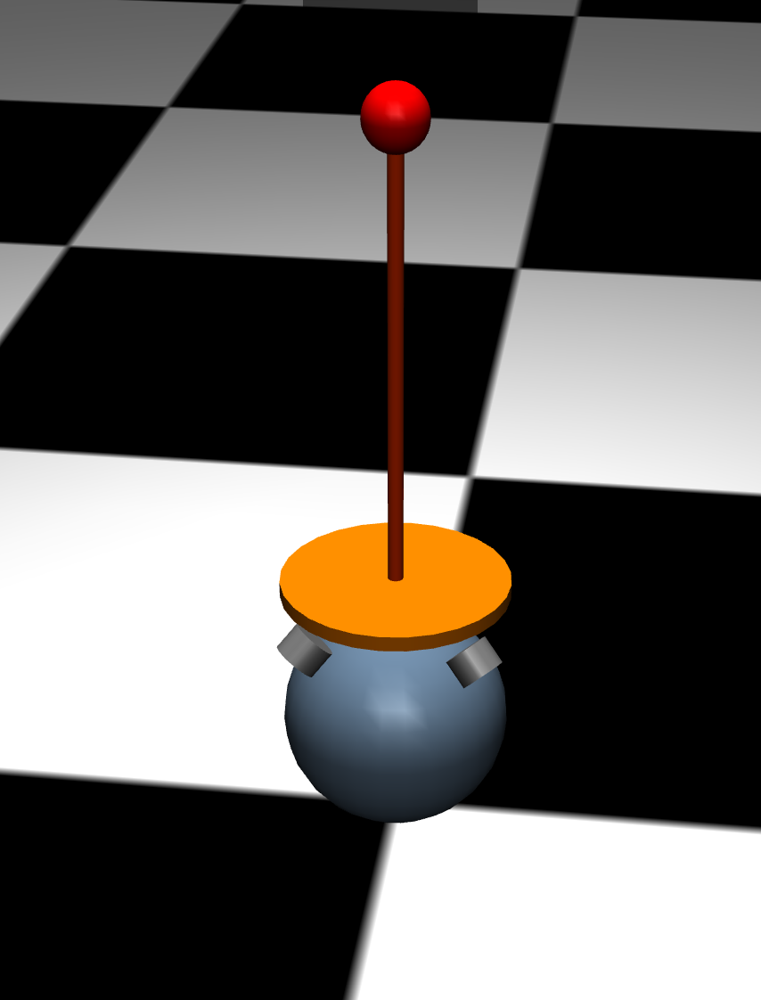

# ball-and-stick-rl


<!-- <video src="static/ball_and_stick.mp4" controls="controls" style="max-width: 730px;" autoplay="autoplay">
</video> -->

# Overview

This repo uses the SAC algorithm to train an agent to balance an inverted pendulum riding on top of a rolling sphere. The agent must
control the xy torques on the sphere to keep the pendulum upright, while also maintaining a target linear velocity.

# Setup

Install dependencies with `poetry`

```bash
poetry install
```

# Training

Launch training with

```bash
./train_sac.sh
```

# Testing

To visualize a trained model in MuJoCo run

```bash
./test_sac.sh
```

# To Launch Viewer

To launch the MuJoCoviewer and imported the ball-and-stick, run

```bash
./viewer.sh
```

# Notes

The PPO algorithm was also implemented but it does not work well (as implemented anyway).

# Training Metrics

The training metrics are logged to https://wanb.ai

For SAC they look something like this:


# In Progress

Working on a more realistic model with omni-wheels in contact with the sphere...


